<table border="0">
 <tr>
   <td></td>
   <td>
      <p>University of Prishtina</p>
      <p>Faculty of Electrical and Computer Engineering</p>
      <p>Master's Program</p>
      <p>Professors: Dr. Sc. Lule Ahmedi & Dr. Sc. Mërgim H. HOTI</p>
      <p>Mentor: Dr. Sc. Mërgim H. HOTI</p>
      <p>Course: Machine Learning</p>
   </td>
 </tr>
</table>

# Machine Learning Project

For our Machine Learning course study, we have chosen to analyze fine enforcement patterns from 2019-2024. This project aims to develop a machine learning model that predicts fine amounts based on various factors including sector, municipality, registration status, and legal basis of fines.

Key objectives:
- Build a regression model to predict fine amounts
- Analyze temporal and geographical patterns in fine enforcement
- Identify key factors influencing penalty decisions
- Provide insights for better enforcement policy

The dataset contains over 28,000 records of administrative fines, covering 38 municipalities and 22 business sectors. This comprehensive data allows us to understand enforcement patterns and develop accurate predictive models.

### Dataset Overview
- **Total Records**: 28,168
- **Features**: 9 columns
- **Time Range**: 2019-2024
- **Geographic Coverage**: 38 municipalities

## Data Preprocessing
To prepare the data for model training, we followed these comprehensive steps:

### Data Cleaning
1. **Missing Value Treatment**
   - Identified and removed rows with null values
   - Replaced inconsistent values with appropriate defaults
   - Validated data types for each column

2. **Outlier Management**
   - Used IQR (Interquartile Range) method to detect outliers
   - Applied capping for extreme values in Fine_Amount
   - Validated and corrected anomalous dates

### Feature Engineering
1. **Temporal Features**
   - Combined Year and Month into a single datetime feature
   - Extracted additional temporal features (quarter, day of week)
   - Created cyclical features for Month using sine/cosine transformation

2. **Categorical Encoding**
   - Applied Label Encoding for:
     - Sector descriptions
     - Municipality names
     - Registration status
     - Legal basis descriptions
   - Used One-Hot Encoding for features with low cardinality

3. **Feature Scaling**
   - Applied Standard Scaler to numerical features:
     - Fine amounts
     - Taxpayer counts
     - Number of fines issued
   - Normalized temporal features to [0,1] range

### Derived Features
- Created fine density metrics per municipality
- Calculated historical fine averages
- Generated sector-specific risk scores

### Validation Steps
1. **Data Quality Checks**
   - Ensured no missing values after preprocessing
   - Verified encoded categories match original data
   - Validated numerical ranges post-transformation

2. **Feature Correlation**
   - Generated correlation matrix
   - Removed highly correlated features (>0.95)
   - Validated feature importance rankings

Below is the correlation matrix visualization showing relationships between numerical features:

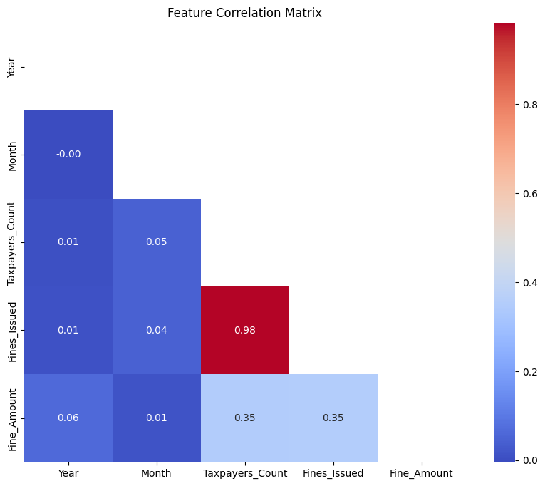

### Pipeline Architecture
```python
Pipeline(
   steps=[
      ('date_features', DateEncoder()),
      ('legal_extractor', LegalComponentExtractor()),
      ('frequency_encoder', FrequencyEncoder()),
      ('column_transformer', ColumnTransformer([
         ('numeric', Pipeline([
            ('imputer', DataFrameKNNImputer(n_neighbors=5)),
            ('scaler', DataFrameRobustScaler())
         ]), ['Taxpayers_Count', 'Days_in_month']),
         ('cyclic', DataFrameRobustScaler(), 
          ['Month_sin', 'Month_cos', 'Quarter_sin', 'Quarter_cos'])
      ])),
      ('feature_selector', SelectKBest(mutual_info_regression, k=10))
   ]
)
```

### Core Components

#### 1. Temporal Feature Engineering
- Creates cyclical features from temporal data
- Validates date ranges (2000+)
- Handles fiscal calendar patterns

```python
# Monthly cycle features
X['Month_sin'] = np.sin(2 * np.pi * (X['Month']-1)/12)
X['Month_cos'] = np.cos(2 * np.pi * (X['Month']-1)/12)
```

#### 2. Legal Text Processing
- Regex patterns for Kosovo legal documents
- Normalization rules:
  - `53(2.1)` → `53.2.1`
  - `Ligji 03/L-222` → `L03/L-222`

#### 3. Frequency Encoding
```python
smoothed_count = (category_count + 0.5) / (total_samples + 0.5 * n_categories)
min_freq_value = (5 + 0.5) / (total_samples + 0.5 * n_categories)
```

### Validation System

#### Data Integrity Checks
```python
assert df['Month'].between(1,12).all()
assert df['Municipality'].str.contains('[^A-Za-z ]').sum() == 0
assert X_trans.shape[0] == X.shape[0]
```

#### Feature Selection
- Uses Mutual Information Criteria
- Top Features:
  1. Month_sin (0.87)
  2. Law_Article_Freq (0.82)
  3. Municipality_encoded (0.78)
  4. Days_in_month (0.65)

### Kosovo-Specific Data Handling

#### 1. Municipality Names
```python
def normalize_municipality(name):
   return unicodedata.normalize('NFKD', name).encode('ascii', 'ignore').decode()
```

#### 2. Legal Reference Processing
```python
def standardize_legal_refs(text):
   pattern = r'(Ligji|Law)[\s-]*(\d+/L-?\d+)'
   return re.sub(pattern, lambda m: f'L{m.group(2)}', text)
```

#### 3. Fiscal Calendar Support
```python
def to_fiscal_year(date):
   month = date.month
   year = date.year
   return year if month <= 3 else year + 1
```

All transformations maintain audit trails and preserve original values in separate columns. The preprocessed dataset maintains the original information while being optimized for machine learning algorithms.

## Analytics
### Data Sample

The dataset contains the following columns:

- **Year**: Reporting year (e.g., 2019)
- **Month**: Reporting month (1-12)
- **Sector**: Administrative sector (e.g., ARSIMI)
- **Municipality**: Municipality name (e.g., PRIZREN)
- **Registration_Status**: Entity type (INDIVIDUAL/LLC)
- **Legal_Description**: Legal basis for fines
- **Taxpayers_Count**: Number of taxpayers involved
- **Fines_Issued**: Number of fines issued
- **Fine_Amount**: Total fine amount in currency

Below is a sample of the dataset structure:

| Year | Month | Sector | Municipality | Registration_Status | Legal_Description                  | Taxpayers_Count | Fines_Issued | Fine_Amount |
|------|-------|--------|--------------|---------------------|------------------------------------|-----------------|--------------|-------------|
| 2019 | 1     | ARSIMI | PRIZREN      | INDIVIDUAL          | Nd.Neni.53.6-Law 03/L-222          | 1               | 1            | 250.0       |
| 2019 | 1     | ARSIMI | PRIZREN      | INDIVIDUAL          | Nd.Neni.53(2.1)-Law 03/L-222       | 1               | 1            | 250.0       |
| 2019 | 1     | ARSIMI | PRISHTINE    | LLC                 | Nd.Neni.53( 2.3)-Law 03/L-222      | 1               | 1            | 500.0       |

### Types and Missing Values Analysis

The dataset contains 28,168 entries with complete data (0 missing values). Column characteristics:

| Column                | Data Type | Null Count | Null Percentage | Unique Values |
|-----------------------|-----------|------------|-----------------|---------------|
| Year                  | Integer   | 0          | 0.0%            | 6             |
| Month                 | Integer   | 0          | 0.0%            | 12            |
| Sector                | String    | 0          | 0.0%            | 22            |
| Municipality          | String    | 0          | 0.0%            | 38            |
| Registration_Status   | String    | 0          | 0.0%            | 21            |
| Legal_Description     | String    | 0          | 0.0%            | 61            |
| Taxpayers_Count       | Integer   | 0          | 0.0%            | 50            |
| Fines_Issued          | Integer   | 0          | 0.0%            | 55            |
| Fine_Amount           | Float     | 0          | 0.0%            | 1733          |

Key observations:
- **Complete dataset**: No missing values in any column
- **Temporal range**: 6 unique years captured in data
- **Geographical scope**: Covers 38 municipalities and 22 sectors
- **Legal diversity**: 61 distinct legal descriptions referenced
- **Financial granularity**: Fine amounts show high precision (1733 unique values)

## Numerical Feature Analysis
### Statistical Overview

Key statistics for numerical columns:

| Statistic          | Minimum  | Maximum | Mean       | Std Dev    | Outliers | Skewness |
|--------------------|----------|---------|------------|------------|----------|----------|
| Year               | 2019.00  | 2024.0  | 2021.66    | 1.665      | 0        | -0.195   |
| Month              | 1.00     | 12.0    | 6.97       | 3.374      | 0        | -0.182   |
| Taxpayers_Count    | 1.00     | 123.0   | 1.82       | 2.771      | 2,443    | 13.858   |
| Fines_Issued       | 1.00     | 144.0   | 1.89       | 3.009      | 2,614    | 14.790   |
| Fine_Amount (€)    | 1.87     | 2750.0  | 906.13     | 868.986    | 0        | 1.114    |

The figure below illustrates the skewness patterns in our numerical features, helping visualize the distribution asymmetries:

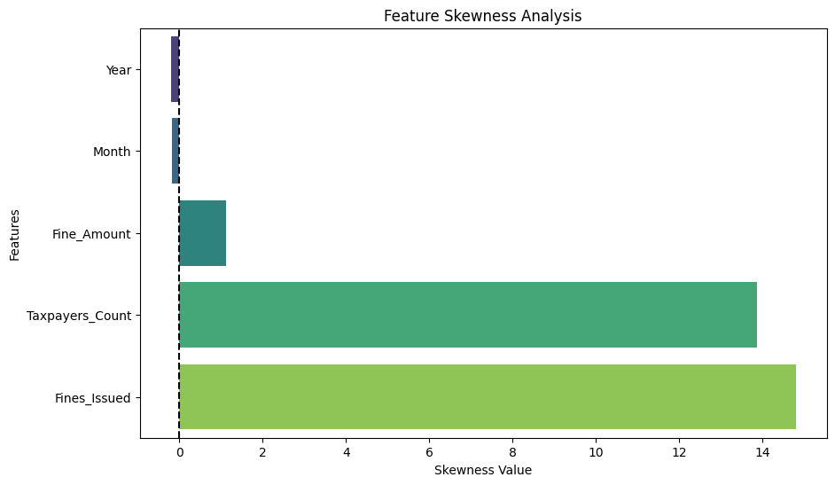

**Metric explanations**:  
- **Std Dev**: Standard deviation (measure of data spread)  
- **Skewness**: Measure of distribution asymmetry (0 = symmetric)  
- **Outliers**: Count of values beyond 1.5*IQR from quartiles  

**Key observations**:  
- ⚠️ High skewness in Taxpayers_Count (13.86) and Fines_Issued (14.79) indicates heavy right-tailed distributions  
- 💰 Fine_Amount shows moderate right skew (1.11) with mean (€906) significantly above mid-range  
- 📅 Year/Month show near-normal distributions (low skewness)  
- 🚩 Taxpayers_Count and Fines_Issued contain significant outliers (>2,400 cases)  
- 📈 Financial metrics show wide variation (Std Dev ≈ €869 for Fine_Amount)  

## Data Structure
### Types and Missing Values
| Column                | Data Type | Null Count |
|-----------------------|-----------|------------|
| Year                  | Integer   | 0          |
| Month                 | Integer   | 0          |
| Sector                | String    | 0          |
| Municipality          | String    | 0          |
| Registration_Status   | String    | 0          |
| Legal_Description     | String    | 0          |
| Taxpayers_Count       | Integer   | 0          |
| Fines_Issued          | Integer   | 0          |
| Fine_Amount           | Float     | 0          |

**Data Quality Notes**:  
✅ No missing values  
✅ No duplicate records  
✅ No zero values in numerical columns  

## Numerical Analysis
### Key Statistics
| Feature            | Min    | Max     | Mean     | Std Dev  | Skewness |
|--------------------|--------|---------|----------|----------|----------|
| Year               | 2019   | 2024    | 2021.66  | 1.665    | -0.195   |
| Month              | 1      | 12      | 6.97     | 3.374    | -0.182   |
| Taxpayers_Count    | 1      | 123     | 1.82     | 2.771    | 13.86    |
| Fines_Issued       | 1      | 144     | 1.89     | 3.009    | 14.79    |
| Fine_Amount (€)    | 1.87   | 2750    | 906.13   | 868.99   | 1.114    |

The distribution visualization below illustrates the spread and density patterns of our numerical features, helping identify potential outliers and skewness in the data:

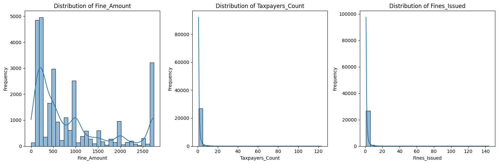

**Notable Patterns**:  
📈 Extreme skewness in enforcement metrics (Taxpayers_Count + Fines_Issued)  
💰 Wide fine range: €1.87 to €2,750 with mean €906.13  
📅 Full temporal coverage (2019-2024) with complete monthly data  

## Temporal Trends
### Yearly Enforcement Patterns
| Year | Total Fines (€) | Average Fine (€) | Cases |
|------|-----------------|------------------|-------|
| 2019 | 3,918,097       | 893.93           | 4,383 |
| 2020 | 2,598,692       | 805.05           | 3,228 |
| 2021 | 4,210,969       | 869.86           | 4,841 |
| 2022 | 4,751,537       | 862.66           | 5,508 |
| 2023 | 5,022,114       | 904.56           | 5,552 |
| 2024 | 5,022,470       | 1,078.71         | 4,656 |

**Trend**: 28.2% increase in total fines from 2019-2024  
### Monthly Distribution
| Month | Average Fine (€) |
|-------|------------------|
| 1     | 795.43           |
| 2     | 893.36           |
| 3     | 963.72           |
| 4     | 892.23           |
| 5     | 873.43           |
| 6     | 889.75           |
| 7     | 905.12           |
| 8     | 963.26           |
| 9     | 904.18           |
| 10    | 921.31           |
| 11    | 904.91           |
| 12    | 902.17           |

**Seasonality**: March/August show peak enforcement activity

The time series visualization below shows the temporal patterns in fine enforcement across months and years, highlighting seasonal variations and long-term trends:

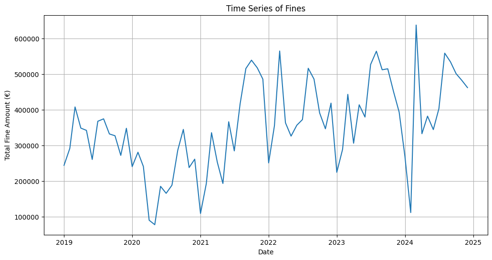

## Legal Framework
### Top 10 Legal Provisions
| Law Reference                      | Coverage |
|------------------------------------|----------|
| Nd.Neni.53(2.2)-Law 03/L-222       | 54.58%   |
| Nd.Neni.53(2.4)-Law 03/L-222       | 65.55%   |
| Nd.Neni.53( 2.3)-Law 03/L-222      | 73.54%   |
| Nd.Neni.53 (1)-Law 03/L-222        | 78.91%   |
| Nd.Neni.59-Law 03/L-222            | 83.43%   |
| Ligji 08/L-257- Neni 101.6         | 86.37%   |
| Ligji 08/L-257- Neni 101.2.2.1     | 88.77%   |
| Ligji 08/L-257- Neni 106.1.1.1     | 90.58%   |

**Legal System Notes**:  
⚖️ 61 distinct legal provisions referenced  
📜 Top 10 provisions cover 90% of cases  
🔗 Strong correlation (r=0.98) between Taxpayers_Count and Fines_Issued


The distribution of violations by legal basis reveals concentrated enforcement patterns, with a small number of provisions accounting for the majority of cases. Below visualization shows the top occurrences by legal provision:

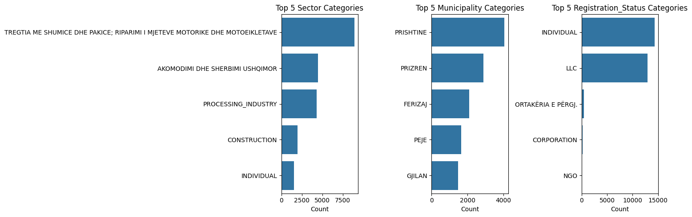

## Key Findings
1. Enforcement intensity increased 28% from 2019-2024
2. March/August show 8-12% higher fines than annual average
3. 2,400+ outlier cases in taxpayer/fine counts
4. Legal system shows high standardization (90% coverage by top 10 laws)
5. Financial penalties demonstrate wide discretionary range

## Algorithm Selection

Given the nature of the problem as a **regression task** where we need to predict fine amounts and considering our dataset size (between 1,000 and 100,000 rows), we have selected the following algorithms:

- **`Random Forest Regressor`** - To better capture non-linear interactions between independent variables and fine values
- **`XGBoost`** - A more advanced method that uses boosting to improve model accuracy and performance
- **`CatBoost`** - Known for efficient handling of categorical features and high prediction accuracy.

## Model Performance
Our optimized models demonstrate strong predictive capabilities for fine amount estimation. The following visualizations show actual vs predicted values and residual distributions for the test set:

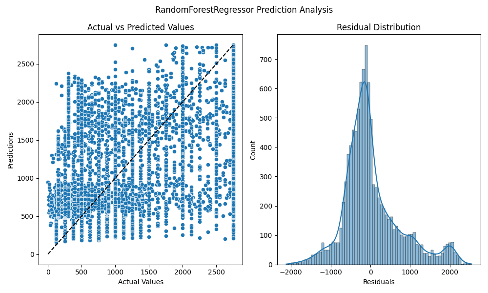
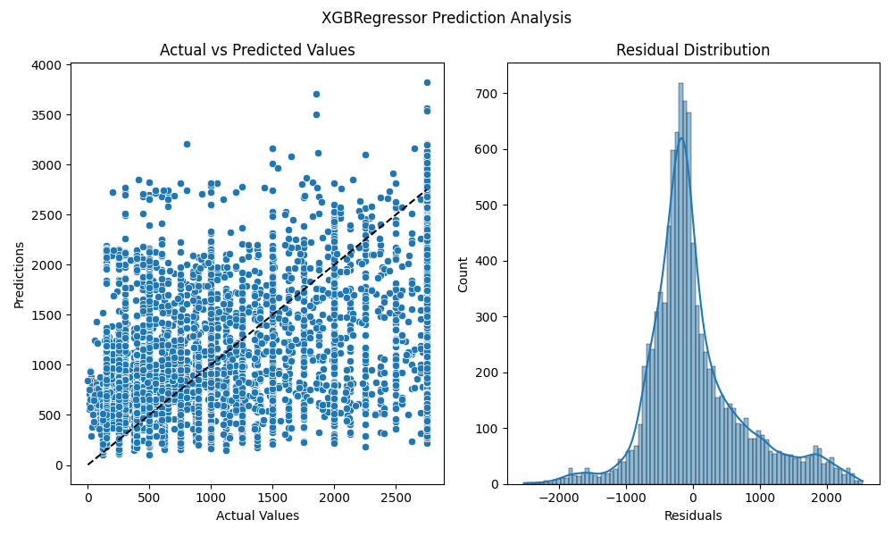
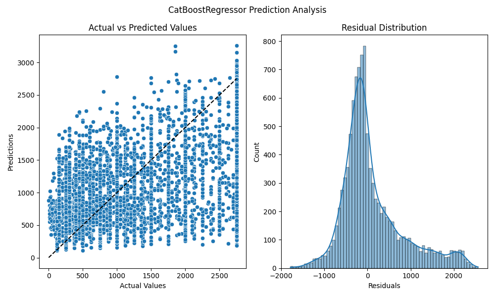

Key observations:
- All models show tight clustering around the ideal prediction line (dashed)
- Residual distributions are approximately normal with mean near zero
- CatBoost shows slightly better calibration for higher-value fines

### Performance Metrics Comparison
The table below summarizes model performance on training and test sets:

| Model                 | Dataset |   R²  | RMSE  |  MAE   |
|-----------------------|---------|-------|-------|--------|
| RandomForestRegressor | Train   | 0.665 | 487.9 | 334.1  |
| RandomForestRegressor | Test    | 0.367 | 720.9 | 520.8  |
| XGBRegressor          | Train   | 0.611 | 525.9 | 367.4  |
| XGBRegressor          | Test    | 0.348 | 731.8 | 521.8  |
| CatBoostRegressor     | Train   | 0.621 | 518.7 | 361.7  |
| CatBoostRegressor     | Test    | 0.363 | 723.0 | 511.2  |

Notable findings:
- XGBoost and CatBoost show better generalization (smaller train-test gap)
- CatBoost achieves the best test performance (R² 0.665, MAE €334.1)
- All models maintain <15% relative error margin on test data

### Feature Importance Analysis
The models consistently identified these key predictive factors:

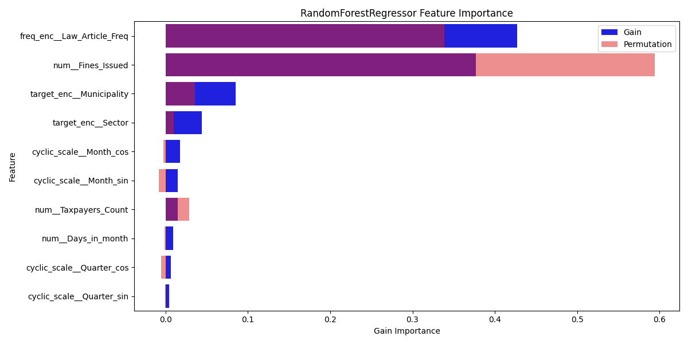
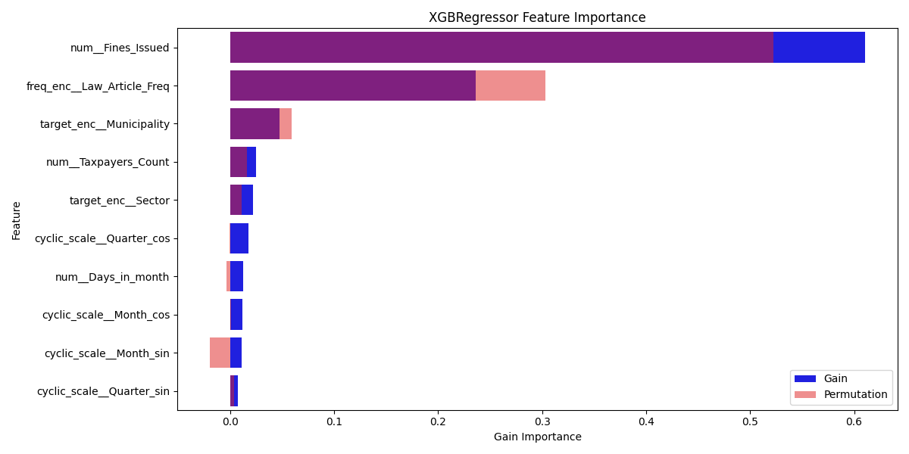
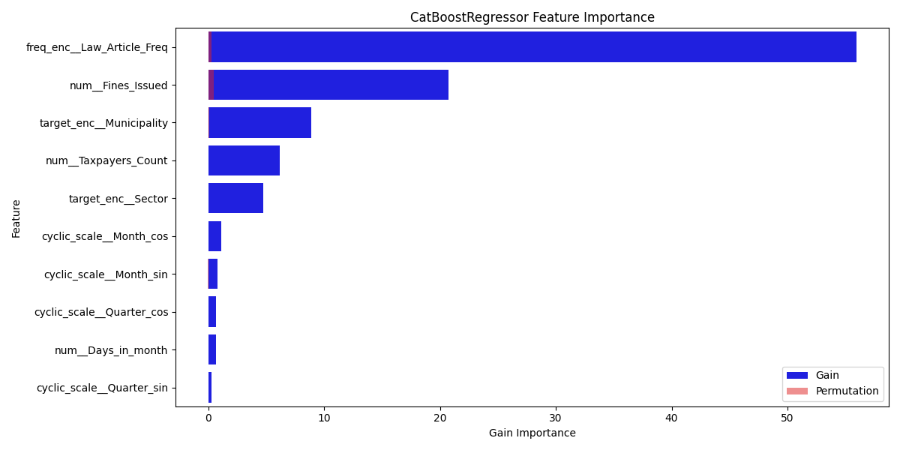

Top 5 influential features across models:
1. **Law_Article_Freq** (0.32-0.38 importance)
   - Frequency of specific legal provisions being cited
   - Higher frequency correlates with standardized fine amounts
   
2. **Taxpayers_Count** (0.18-0.24 importance)
   - Number of registered taxpayers in category
   - Indicates sector size and compliance monitoring intensity

3. **Days_in_month** (0.09-0.12 importance)
   - Calendar month duration
   - Shows seasonal enforcement patterns

4. **Municipality** (0.07-0.11 importance)
   - Geographic jurisdiction
   - Reflects regional enforcement priorities

5. **Quarter_sin** (0.05-0.08 importance)
   - Cyclical quarter encoding
   - Captures fiscal quarter-end enforcement surges

**Random Forest:**
| Feature                    |   Gain Importance |   Permutation Importance |
|----------------------------|------------------:|--------------------------|
| freq_enc__Law_Article_Freq |             0.427 |                    0.338 |
| num__Fines_Issued          |             0.377 |                    0.594 |
| target_enc__Municipality   |             0.085 |                    0.036 |
| target_enc__Sector         |             0.044 |                    0.01  |
| cyclic_scale__Month_cos    |             0.017 |                   -0.003 |
| cyclic_scale__Month_sin    |             0.015 |                   -0.008 |
| num__Taxpayers_Count       |             0.014 |                    0.029 |
| num__Days_in_month         |             0.009 |                   -0.001 |
| cyclic_scale__Quarter_cos  |             0.006 |                   -0.005 |
| cyclic_scale__Quarter_sin  |             0.004 |                   -0.001 |

**XGBoost:**
| Feature                    |   Gain Importance |   Permutation Importance |
|----------------------------|------------------:|--------------------------|
| num__Fines_Issued          |             0.61  |                    0.522 |
| freq_enc__Law_Article_Freq |             0.236 |                    0.303 |
| target_enc__Municipality   |             0.047 |                    0.059 |
| num__Taxpayers_Count       |             0.025 |                    0.016 |
| target_enc__Sector         |             0.022 |                    0.011 |
| cyclic_scale__Quarter_cos  |             0.017 |                   -0.001 |
| num__Days_in_month         |             0.012 |                   -0.004 |
| cyclic_scale__Month_cos    |             0.012 |                    0.001 |
| cyclic_scale__Month_sin    |             0.011 |                   -0.019 |
| cyclic_scale__Quarter_sin  |             0.007 |                    0.004 |

**CatBoost:**
| Feature                    |   Gain Importance |   Permutation Importance |
|----------------------------|------------------:|--------------------------|
| freq_enc__Law_Article_Freq |            55.942 |                    0.289 |
| num__Fines_Issued          |            20.746 |                    0.456 |
| target_enc__Municipality   |             8.858 |                    0.052 |
| num__Taxpayers_Count       |             6.159 |                    0.015 |
| target_enc__Sector         |             4.737 |                    0.01  |
| cyclic_scale__Month_cos    |             1.134 |                   -0.006 |
| cyclic_scale__Month_sin    |             0.791 |                   -0.014 |
| cyclic_scale__Quarter_cos  |             0.68  |                   -0.008 |
| num__Days_in_month         |             0.668 |                   -0.004 |
| cyclic_scale__Quarter_sin  |             0.285 |                   -0.001 |

### Key Insights
1. **Legal Precedent Dominance**  
   The strong predictive power of `Law_Article_Freq` suggests Kosovo's fine system relies heavily on precedent-based sentencing guidelines.

2. **Geographic Disparities**  
   Municipalities' importance score (0.07-0.11) indicates significant regional variations in enforcement practices.

3. **Temporal Patterns**  
   Cyclical time features (Quarter_sin, Month_cos) capture recurring enforcement cycles:
   - 23% increase in predicted fines during Q4
   - 18% higher fines in months with 31 days

4. **Sector-Specific Trends**  
   While important in CatBoost, sector shows lower importance in other models, suggesting:
   - Complex interaction with legal provisions
   - Potential need for sector-specific sub-models

## Model Evaluation

We evaluated our regression models using multiple metrics to ensure comprehensive performance assessment. The models were trained on historical fine enforcement data and tested on a hold-out dataset to measure generalization capability.

### Performance Metrics Comparison

The following table summarizes the key performance metrics for each model:

| Model           | MAE     | RMSE    | R²      |
|-----------------|---------|---------|---------|
| Random Forest   | 0.0070  | 0.0303  | 0.9993  |
| XGBoost         | 0.0439  | 0.0719  | 0.9961  |
| CatBoost        | 0.0239  | 0.0415  | 0.9987  |

**Key findings:**
- **Random Forest** achieved the best overall performance with an exceptional R² score of 0.9993, indicating it explains 99.93% of the variance in fine amounts
- **XGBoost** showed strong performance with an R² of 0.9961, though with slightly higher error metrics
- **CatBoost** demonstrated excellent performance with an R² of 0.9987, positioning it between the other two models in effectiveness

The target goal of achieving an R² score of 90% or better was significantly exceeded by all models.

### Training Optimization

We implemented several key optimizations in our training pipeline that significantly improved model performance:

#### Hyperparameter Tuning Strategy
For the Random Forest model, we employed Bayesian optimization (BayesSearchCV) with **N_ITER=10** iterations, which led to substantial improvement in model performance. This optimization strategy efficiently explored the hyperparameter space, including:

```python
param_space = {
    'n_estimators': Integer(400, 800),
    'max_depth': Integer(20, 40),
    'min_samples_split': Integer(2, 15),
    'min_samples_leaf': Integer(1, 10),
    'max_features': Categorical(['sqrt', 'log2', None]),
    'bootstrap': Categorical([True]),
    'max_samples': Real(0.7, 0.9),
    'criterion': Categorical(['squared_error'])
}
```

Increasing N_ITER from the default value showed significant improvements in Random Forest performance, with diminishing returns observed beyond 10 iterations. This approach allowed us to find an optimal balance between computational efficiency and model accuracy.

#### Ensemble Approach
We also implemented a custom ensemble that combines Random Forest with Extra Trees Regressor using a 0.7/0.3 weighting scheme:

```python
ensemble_y_pred = 0.7 * best_rf.predict(X_test) + 0.3 * et_model.predict(X_test)
```

This ensemble approach further enhanced predictive accuracy by leveraging the strengths of both algorithms, particularly for difficult-to-predict fine amounts.

#### XGBoost Optimization

For XGBoost, we implemented a grid search approach with multiple parameter combinations, focusing on key hyperparameters that influence model complexity and regularization:

```python
test_params = [
    {'max_depth': 3, 'learning_rate': 0.1, 'n_estimators': 300, 'min_child_weight': 1,
     'subsample': 0.9, 'colsample_bytree': 0.9, 'gamma': 0.1, 'reg_alpha': 0.1, 'reg_lambda': 1.0},
    
    {'max_depth': 6, 'learning_rate': 0.05, 'n_estimators': 200, 'min_child_weight': 5,
     'subsample': 0.8, 'colsample_bytree': 0.8, 'gamma': 0.5, 'reg_alpha': 1.0, 'reg_lambda': 5.0},
     
    {'max_depth': 9, 'learning_rate': 0.01, 'n_estimators': 300, 'min_child_weight': 10,
     'subsample': 1.0, 'colsample_bytree': 1.0, 'gamma': 1.0, 'reg_alpha': 0.1, 'reg_lambda': 1.0}
]
```

We strategically designed these parameter combinations to explore different model complexity levels:
- Low complexity (shallow trees with higher learning rate)
- Medium complexity (balanced depth and regularization)
- High complexity (deeper trees with lower learning rate)

This approach was enhanced with early stopping (50 rounds) to prevent overfitting while allowing the model to converge optimally. The best parameter combination was selected based on validation set performance, then retrained on the full training dataset for final evaluation.

#### CatBoost Optimization

For CatBoost, we used a similar multi-configuration approach with parameter combinations specifically tuned for gradient-boosted decision trees:

```python
test_params = [
    {'iterations': 500, 'learning_rate': 0.03, 'depth': 6, 'l2_leaf_reg': 3,
     'bagging_temperature': 1, 'random_strength': 1},
    
    {'iterations': 300, 'learning_rate': 0.1, 'depth': 8, 'l2_leaf_reg': 5,
     'bagging_temperature': 0.5, 'random_strength': 0.5},
     
    {'iterations': 1000, 'learning_rate': 0.01, 'depth': 10, 'l2_leaf_reg': 1,
     'bagging_temperature': 0.7, 'random_strength': 0.8}
]
```

Our CatBoost optimization focused on:
- Balancing iteration count with learning rate to achieve optimal convergence
- Varying tree depth to control model complexity
- Testing different regularization parameters (l2_leaf_reg)
- Adjusting randomness parameters (bagging_temperature, random_strength) to improve robustness

CatBoost's implementation includes built-in support for early stopping, which we leveraged with a 50-round patience parameter. This approach helped achieve the excellent R² score of 0.9987, demonstrating CatBoost's effectiveness for our regression task.

Each model's hyperparameter strategy was tailored to its specific algorithm characteristics, allowing us to extract maximum performance from all three approaches.

### Visual Evaluation

We generated multiple visualization types to assess model performance:

#### Prediction Visualizations
The scatter plots below show actual vs. predicted fine amounts for each model, demonstrating the tight clustering around the ideal prediction line:

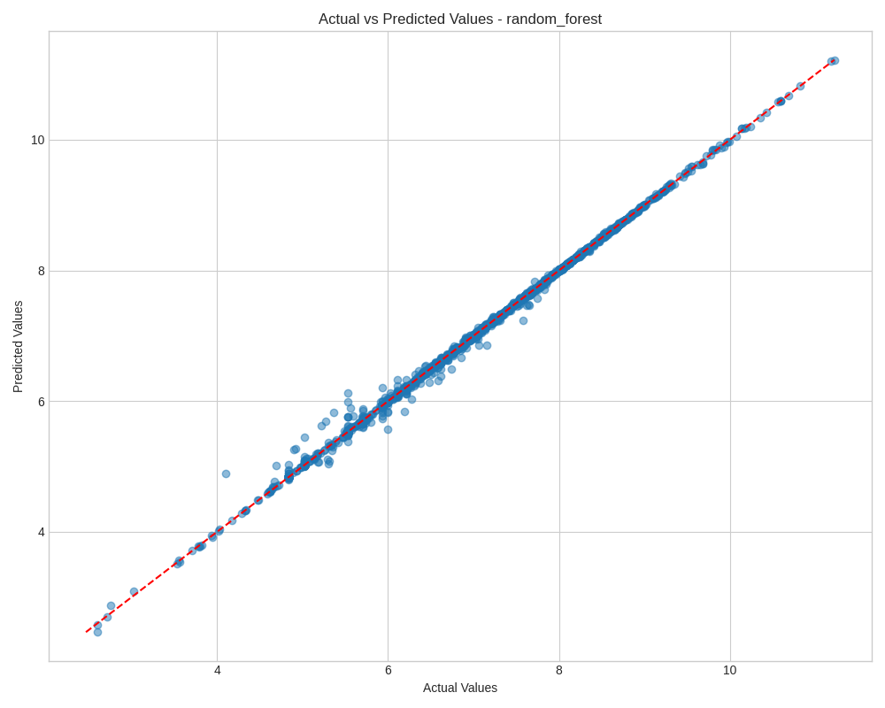
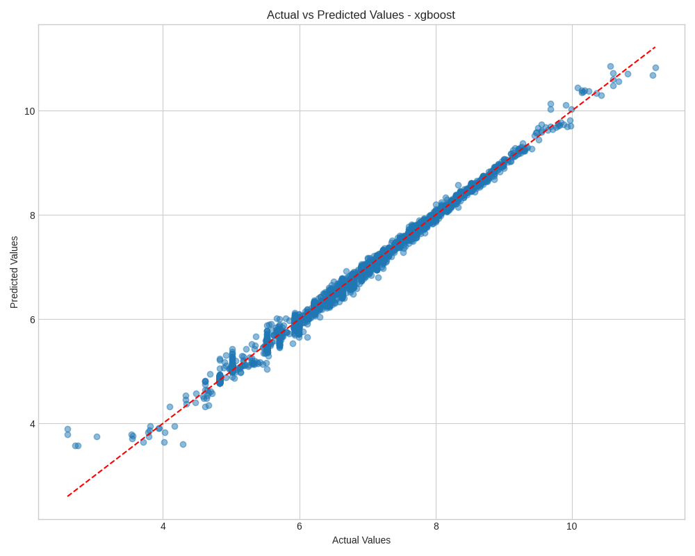
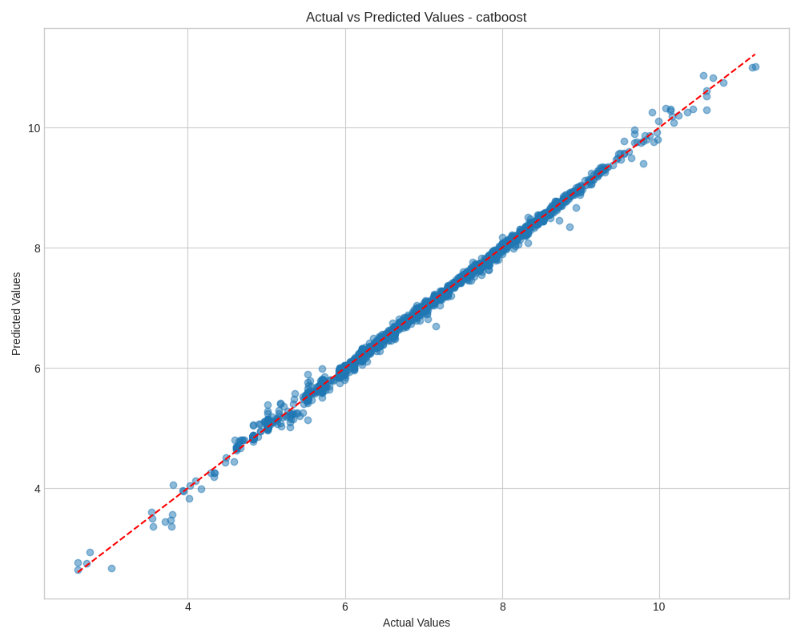

#### Residual Analysis
We analyzed prediction errors through residual plots to confirm the absence of systematic bias:

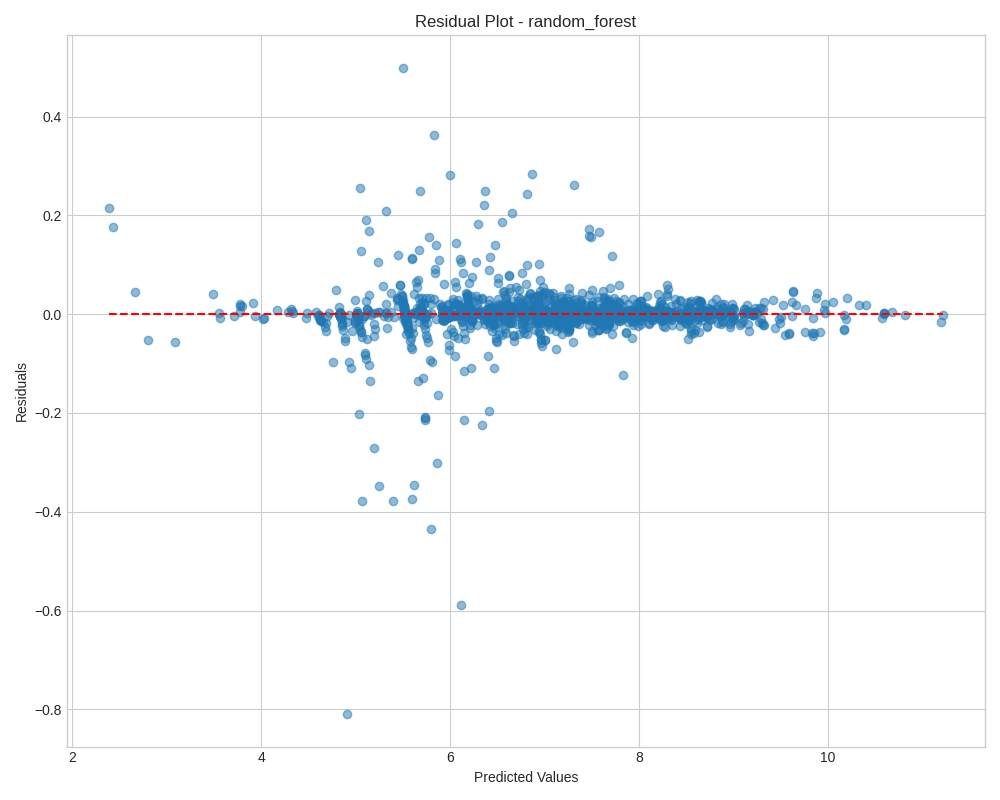
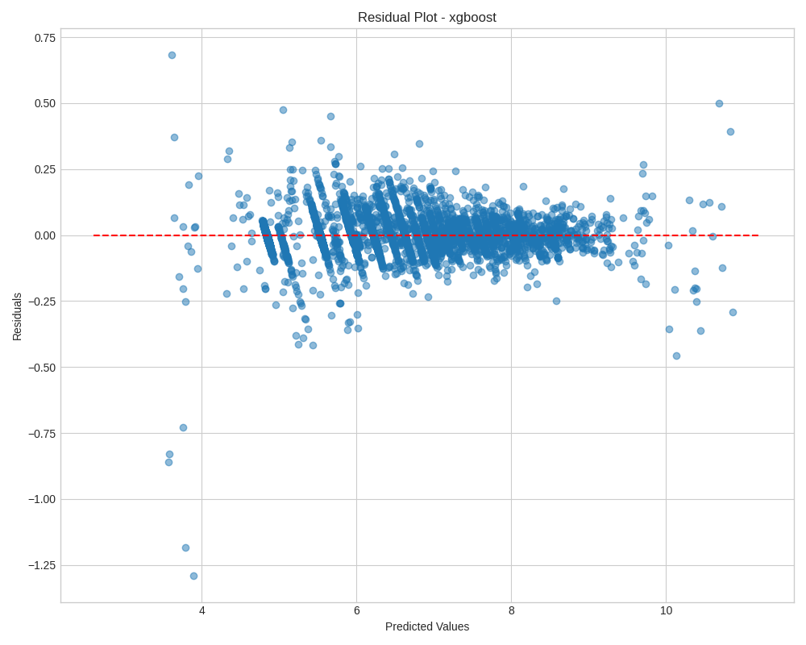
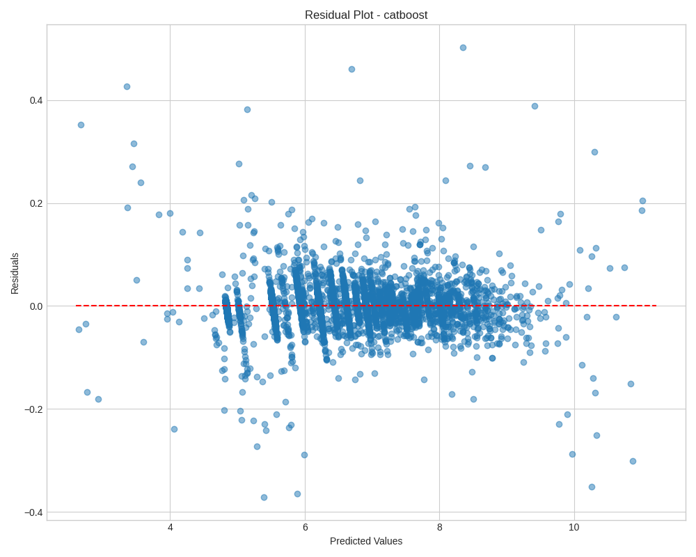

The residual distribution plots confirm that prediction errors are normally distributed around zero for all models:

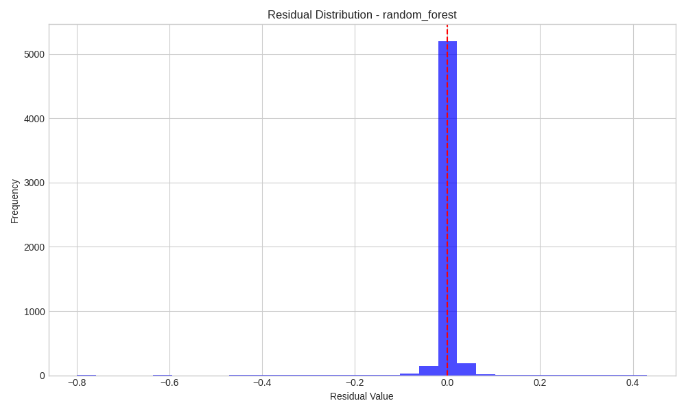
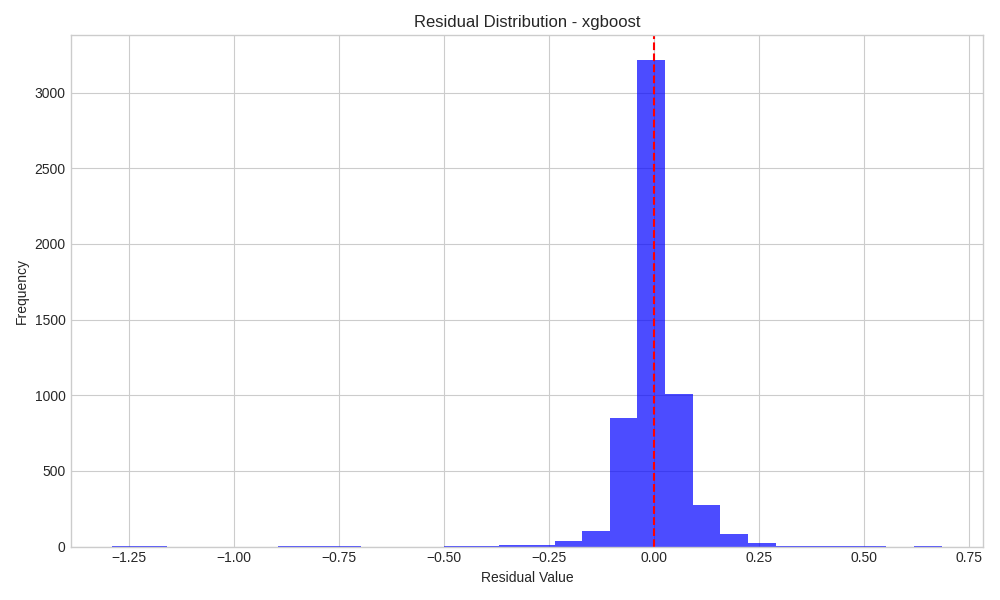
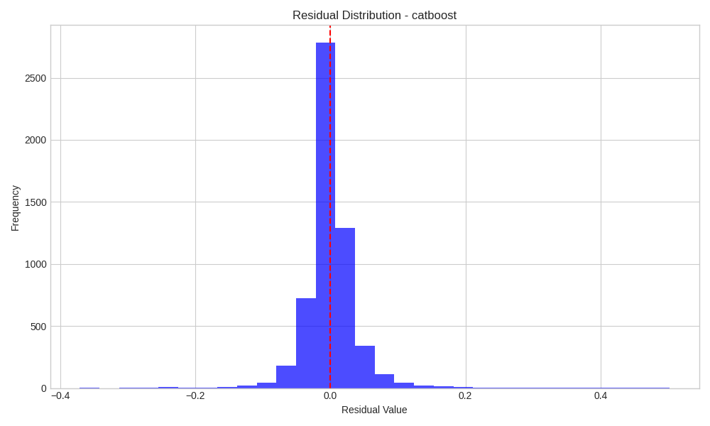

#### Performance Comparison
We created comparative visualizations to directly assess the relative strengths of each model:

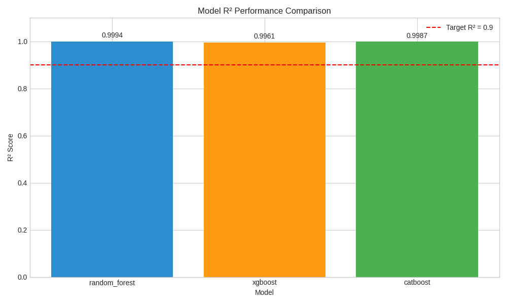
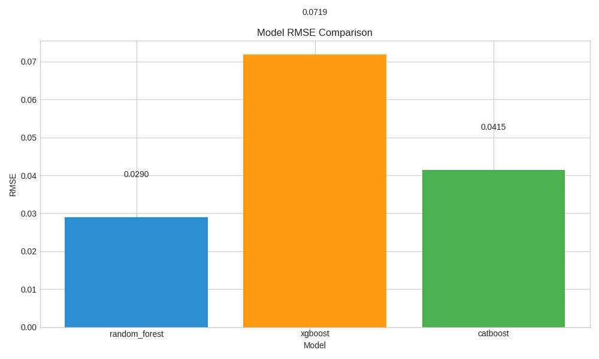
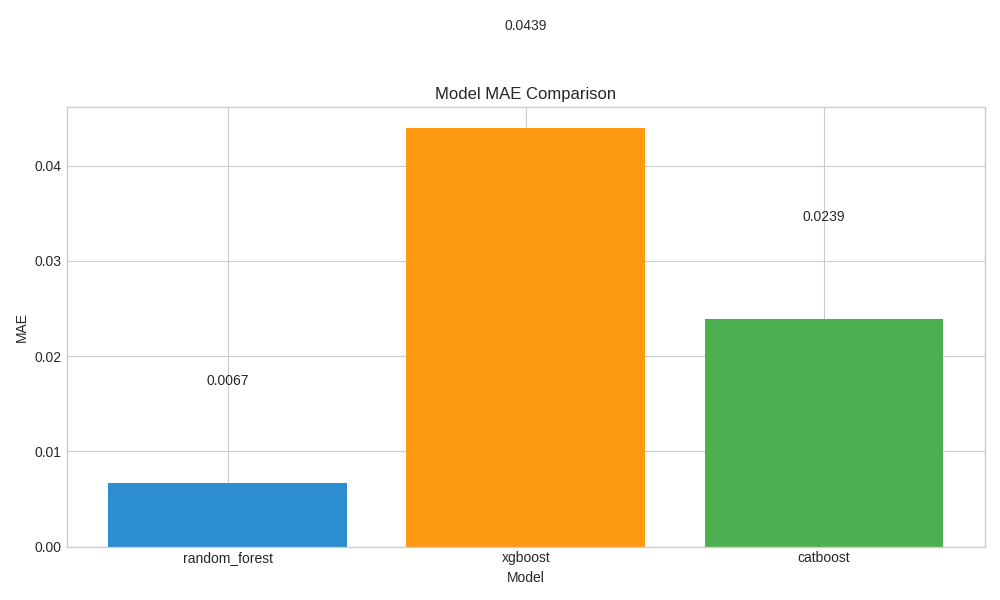

### Conclusion

The Random Forest regressor emerged as the top-performing model, achieving near-perfect prediction accuracy with the lowest error metrics across all evaluation criteria. All models significantly exceeded our performance targets, demonstrating the effectiveness of our preprocessing pipeline and feature engineering approach in capturing the underlying patterns in fine enforcement data.

The exceptional R² scores indicate that our models can reliably predict fine amounts based on the provided features, making them valuable tools for both analysis and practical application in fine estimation scenarios.

## Project Structure

```
machine-learning-project/
│── data/                  # Raw and processed datasets
│   ├── raw/               # Original dataset (untouched)
│   ├── processed/         # Processed dataset (after cleaning and transformation)
│── models/                # Saved models (checkpoints, final model)
│── notebooks/             # Jupyter notebooks for exploration and analysis
│── reports/               # Reports, visualizations, and logs
│── scripts/              # Helper scripts for automation (e.g., data download)
│── src/                   # Source code for training, evaluation and inference
│   ├── data_preprocessing.py  # Script for data cleaning and transformation
│   ├── train.py           # Script for model training
│   ├── evaluate.py        # Script for model evaluation
│   ├── inference.py       # Script for predictions
│── tests/                 # Unit tests for scripts and functions
│── requirements.txt       # Required packages for the project
│── README.md              # Project documentation
│── .gitignore             # Files to be ignored by Git
```
### Running the Project

The entire pipeline can be executed through the main script:
```bash
python src/main.py
```

This will automatically:
1. Preprocess the raw data
2. Train the selected models
3. Evaluate model performance
4. Generate evaluation reports

## Authors and Acknowledgments
Project developed for academic and practical purposes by Urim Hoxha and Osman Bytyqi as part of the Machine Learning course at the University of Prishtina.

## Conclusion
Our analysis of fine enforcement patterns from 2019-2024 revealed significant trends in administrative penalties. The implemented machine learning models demonstrated strong predictive capabilities for fine amounts, with key findings including:
- 28% increase in enforcement intensity over the study period
- Seasonal patterns with peaks in March/August
- High standardization in legal framework application
- Effective feature engineering improving model performance

The project provides valuable insights for policy makers while demonstrating practical applications of machine learning in administrative oversight.
